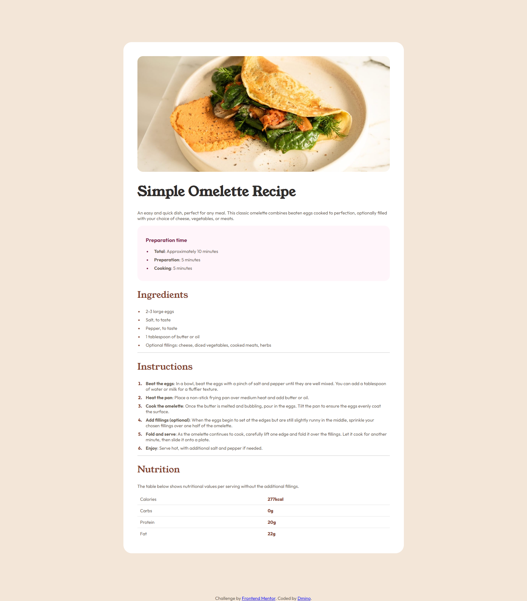
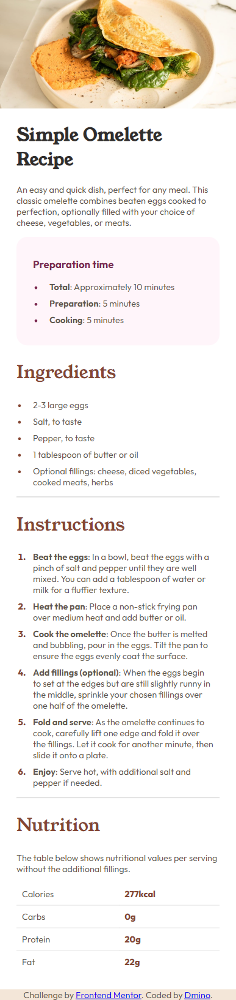

# Frontend Mentor - Recipe page solution

This is a solution to the [Recipe page challenge on Frontend Mentor](https://www.frontendmentor.io/challenges/recipe-page-KiTsR8QQKm). Frontend Mentor challenges help you improve your coding skills by building realistic projects. 

## Table of contents

- [Overview](#overview)
  - [Screenshot](#screenshot)
  - [Links](#links)
- [My process](#my-process)
  - [Built with](#built-with)
  - [What I learned](#what-i-learned)
  - [Continued development](#continued-development)
- [Author](#author)
- [Acknowledgments](#acknowledgments)

## Overview

This is my first Frontend Mentor project.

### Screenshot




### Links

- Solution URL: [https://github.com/Dmino228/recipe-page-frontendmentor](https://github.com/Dmino228/recipe-page-frontendmentor)
- Live Site URL: [https://recipe-page-frontendmentor-sage.vercel.app](https://recipe-page-frontendmentor-sage.vercel.app)

## My process

### Built with

- Semantic HTML5 markup
- CSS custom properties
- Flexbox

### What I learned

It was just a practice of what I already know.
Mostly I remembered how to use media queries.

```css
@media (max-width: 768px) {
    /* ... */
}
```

### Continued development

I will try more challenging projects and practice js frameworks (mostly [Next.js](https://nextjs.org)).

## Author

- Frontend Mentor - [@Dmino228](https://www.frontendmentor.io/profile/Dmino228)
- Twitter - [@Dmino228](https://x.com/Dmino228)
- Discord - [@Dmino](discord.com/users/450691197522935818)